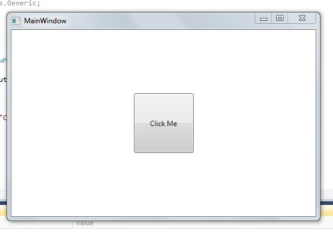

# Basic MVVM and ICommand Usage Example

# Introduction

We will learn about WPF Commands. Commands go very well with MVVM pattern (Model- View-ViewModel). We will also see how actually the view knows about its `ViewModel` and how the view invokes the operations on `ViewModel` which can be done by using Commands in WPF.

# Background

Let’s have a look at the MVVM architecture.


We use the standard conventions for naming the classes as follows:

* `Views` are suffixed with `View` after the name of the `View` (e.g.: `StudentListView`)
* `ViewModels` are suffixed with `ViewModel` after the name of the `ViewModel`. (e.g.: `StudentListViewModel`)
* `Models` are suffixed with `Model` after the name of the `Model` (e.g.: `StudentModel`).


# Using the Code

Let’s dive into the code and see a working example for MVVM and how to use commands in MVVM.

Create a new WPF project in Visual Studio. Rename the `MainWindow` as `MainWindowView` to follow up our conventions.

Next, we need to create a new class with name `MainWindowViewModel` that will act as the `ViewModel` for the `MainWindowView`.

What we do here in MVVM is that we tell the `View` about what its `ViewModel` will be. This can be done by setting the Data Context for that view. `Models` are used in the `ViewModel` and they do not have any connection between some specific views.

Example code for setting the `Datacontext` goes like this.

Open the `MainWindowView.xaml.cs` and set the data context as follows.

```xml
<Window x:Class="WpfExample.MainWindowView"
        xmlns="http://schemas.microsoft.com/winfx/2006/xaml/presentation"
        xmlns:x="http://schemas.microsoft.com/winfx/2006/xaml"
        Title="MainWindow" Height="350" Width="525"
        xmlns:local="clr-namespace:WpfExample">

    <Window.DataContext>
        <local:MainWindowViewModel/>
    </Window.DataContext>

    <Grid>
    </Grid>
</Window>
```

Here the `local` is an alias to our namespace `WpfExample`. It’s required so that the framework knows where `MainWindowViewModel` is available.

Now we have set the MVVM pattern. Now the `MainWindowView` knows that’s its `ViewModel` is `MainWindowViewModel`.

We will verify this by using a simple binding.

Let's add a button to view and set the button content using a instance from `ViewModel`.

## The View
We will add the button to the view and we will set its content using binding as follows:

**MainWindowView.xaml.cs**
```xml
<Window x:Class=" WpfMvvmExample.MainWindow"
        xmlns="http://schemas.microsoft.com/winfx/2006/xaml/presentation"
        xmlns:local="clr-namespace:WpfMvvmExample"
        xmlns:x="http://schemas.microsoft.com/winfx/2006/xaml"
        Title="MainWindow" Height="350" Width="525">

    <Window.DataContext>
        <local:MainWindowViewModel/>
    </Window.DataContext>

    <Grid>
        <Button Width="100" 
        Height="100" Content="{Binding ButtonContent}"/>
    </Grid>
</Window>
```

**The ViewModel**
```cs
namespace WpfExample
{
    class MainWindowViewModel
    {
        public string ButtonContent
        {
            get
            {
                return "Click Me";
            }
        }
    }
}
```

In the above code, we are telling the `View` to fetch the content of `button` from `ButtonContent` property present in the `ViewModel`.


Now if we run the application, we can see that the button content is set to `string “Click Me”`.



So this interprets that our MVVM is working properly.